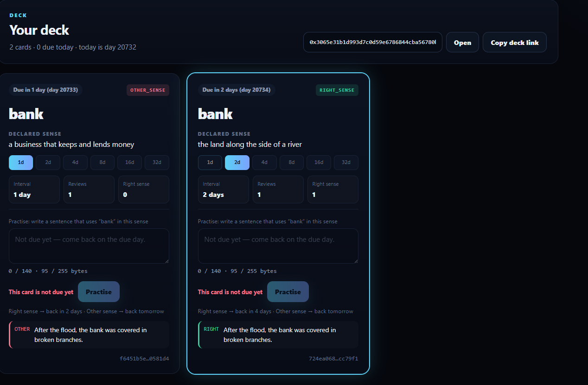

RightSense does not grade grammar or style, and it does not decide which meaning a word "really" has. It checks one thing about each practice sentence: does the word carry the sense you said you were learning — and that alone sets when the card comes back.

<p align="center"></p>

# RightSense

Sense-checked flashcards: GenLayer validators read each practice sentence for the sense you declared, and the reading sets
the spaced-repetition schedule. GenLayer StudioNet (chain 61999) · py-genlayer v0.2.

**The contract holds no money.** It keeps decks of flashcards, how each practice sentence was read, and when each card
is next due.

| | |
|---|---|
| Contract source | `contracts/WordSense.py` (SHA-256 in `SOURCE_SHA256.txt`) |
| Project deployment | [`0x139a515380ab68eA4c9ae5f9005D4Cd365888ED5`](https://explorer-studio.genlayer.com/address/0x139a515380ab68eA4c9ae5f9005D4Cd365888ED5) |
| Intelligent Contract | WordSense — the same frozen source, deployed separately at [`0x8A38F1c8c3FF97fe67AE45dD4c029fAF9C92C6f4`](https://explorer-studio.genlayer.com/address/0x8A38F1c8c3FF97fe67AE45dD4c029fAF9C92C6f4) |
| Live app | https://right-sense-gamma.vercel.app |
| Evidence | `RUNTIME_EVIDENCE.md` (one tx hash per row) · `TESTING.md` |

## What it does

A learner adds a card: one term and the one sense of it they are learning (`bank` = `the land along the side of a
river`). To practise a card that is due, they write a sentence of their own. The contract first checks, without the
model, that the sentence contains the term as a whole word (`banked` is refused). Validators then read the sentence
**once** and decide one thing:

| | `RIGHT_SENSE` | `OTHER_SENSE` |
|---|---|---|
| Meaning | the term carries the declared sense | it carries another sense, or none can be told |
| Interval | `min(interval × 2, 32)` days | back to 1 day |
| Next due | the day of the practice + the interval | tomorrow |

A new card is due on the day it is added; a card answered right every time comes back after 2, 4, 8, 16 and then every
32 days. On StudioNet, "After the flood, the bank was covered in broken branches." and "After the crash, the bank was
covered in angry headlines." share one frame; on a card declaring `a business that keeps and lends money` the first was
read **OTHER_SENSE** and the second **RIGHT_SENSE** — the outcome follows the sense the learner declared. Through this
app, the flood sentence on a money-sense card was read OTHER_SENSE (back tomorrow) and the very same sentence on a
river-sense card RIGHT_SENSE (back in 2 days).



Only the owner practises a card, only when it is due, and each sentence once per card. Unclear readings count as
OTHER_SENSE, so a card never skips ahead on a guess.

## What the app shows

- **Overview**: how the reading sets the schedule.
- **Deck**: every card of a wallet, the next review first — the term, the declared sense, a ladder 1d · 2d · 4d · 8d ·
  16d · 32d marking the current interval, the due day, reviews and right-sense count, and the last outcome. On your own
  due card, a sentence box with a byte meter and a preview ("Right sense → back in 2 days · Other sense → back
  tomorrow"); *Practise* is disabled with the contract's own sentence when the card is not due, the sentence does not
  use the whole word, or you already used it. Anyone can open any deck by wallet; only its owner can practise it.
- **Add a card**: term and sense; the card id is shown before you sign.
- **Verification**: contract address, source SHA-256, the rubric hash and limits read from `get_limits`.

After every write the app waits for consensus to accept it, re-reads the card, and only then reports what happened — for
a practice, how validators read the sentence and when the card comes back.

## How to try it

You need **one wallet** on GenLayer StudioNet (a second one shows the owner check). No GEN is spent beyond fees.

1. *Add a card*: term `bank`, sense `a business that keeps and lends money`.
2. In *Deck*, practise it with `After the flood, the bank was covered in broken branches.` — read OTHER_SENSE, back
   tomorrow. Add a second card `bank` / `the land along the side of a river` and practise it with the same sentence —
   read RIGHT_SENSE, back in 2 days.
3. Type a sentence without the whole word (`We banked the fire.`): *Practise* stays disabled with "The sentence does not
   use the term". Open your deck from another wallet: *Practise* is disabled with "Only the card's owner may practise it".

## Methods

| Write | Who | Checks, in order |
|---|---|---|
| `add_card(term, sense)` | anyone (their own deck) | term 1–30 → sense 1–100 → no reserved token → fewer than 50 cards → not already in the deck |
| `practice(card_id, sentence)` | the card's owner | known id → owner → due → sentence 1–140 → no reserved token → uses the term as a whole word → not used before → **the only model call** |

Views return JSON strings: `get_card`, `get_deck` (sorted by due day), `get_rubric`, `get_limits`. The full specification
is in `LOCKED_SPEC.md`.

## Run locally

```bash
npm ci
npm run dev            # http://localhost:5173 (the /genlayer-rpc proxy is in vite.config.ts)
npm run build && npm test
npm run verify:source
python3 -m pytest tests/contract -q -p no:cacheprovider   # needs genlayer-test 0.29.2
```

`VITE_CONTRACT_ADDRESS` overrides the deployment address. On Vercel, `vercel.json` declares the same proxy.

## Honest limitation

1. **No grading of the language itself.** A clumsy sentence that carries the right sense is RIGHT_SENSE.
2. **The sense is the learner's own words.** A vague sense makes the reading vague; vague readings count as OTHER_SENSE.
3. **A wrong RIGHT_SENSE is the main risk** — it pushes an unlearned card out by days. Nets: unclear output is
   OTHER_SENSE, and each sentence counts once per card.
4. **Days come from the transaction's time** (UTC), not the learner's clock.
5. **Sentences with many non-ASCII characters** can pass the 255-byte calldata limit before 140 characters; the byte
   meter stops them.

License: MIT.
